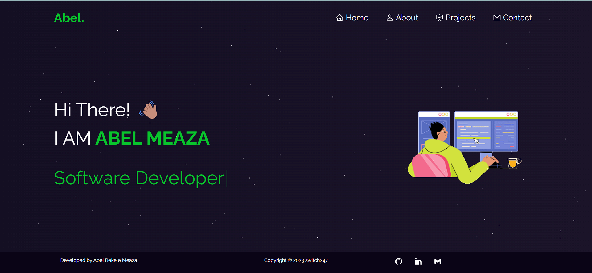
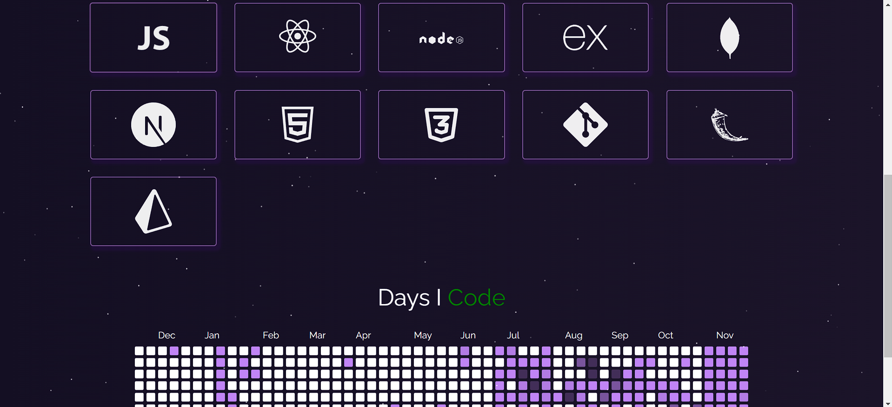
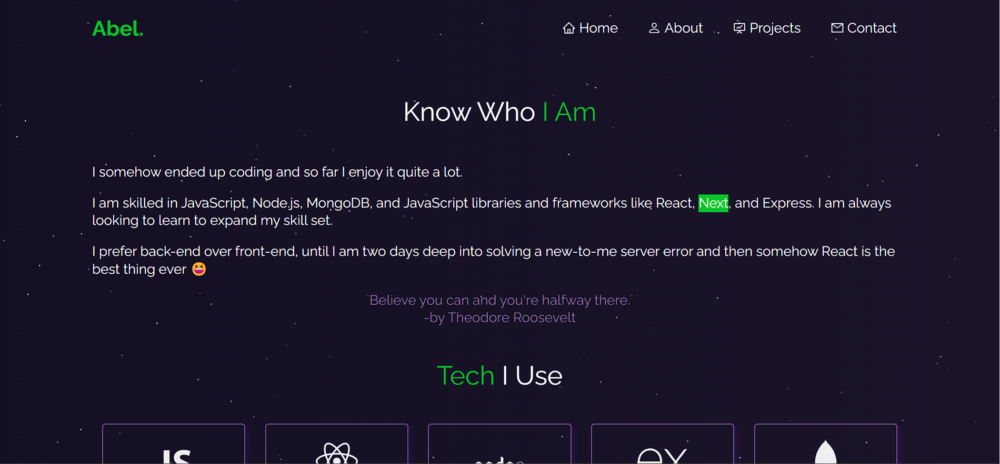

<a name="readme-top"></a>

<!-- [![Contributors][contributors-shield]][contributors-url]
[![Forks][forks-shield]][forks-url]
[![Stargazers][stars-shield]][stars-url]
[![Issues][issues-shield]][issues-url]
[![MIT License][license-shield]][license-url]
[![LinkedIn][linkedin-shield]][linkedin-url] -->

<!-- PROJECT LOGO -->
<br />
<div align="center">


  <h3 align="center">My Portfolio</h3>

  <p align="center">
    Welcome to Skinology, a fullstack ecommerce application.
    <br />
    <a href="https://github.com/Ree-m/skinology-ecommerce-app"><strong>Explore the docs »</strong></a>
    <br />
    <br />
    <a href="https://skinology-ecommerce-app-client.onrender.com/">View Demo</a>
    ·
    <a href="https://github.com/Ree-m/skinology-ecommerce-app/issues">Report Bug</a>
    ·
    <a href="https://github.com/Ree-m/skinology-ecommerce-app/issues">Request Feature</a>
  </p>
</div>

<!-- TABLE OF CONTENTS -->
<details>
  <summary>Table of Contents</summary>
  <ol>
    <li>
      <a href="#about-the-project">About The Project</a>
      <ul>
        <li><a href="#built-with">Built With</a></li>
       li><a href="#features">Features</a></li>
      </ul>
    </li>
    <li>
      <a href="#getting-started">Getting Started</a>
      <ul>
        <li><a href="#prerequisites">Prerequisites</a></li>
        <li><a href="#installation">Installation</a></li>
      </ul>
    </li>
    <li><a href="#usage">Usage</a></li>
    <li><a href="#contributing">Contributing</a></li>
    <li><a href="#license">License</a></li>
    <li><a href="#contact">Contact</a></li>
    <li><a href="#acknowledgments">Acknowledgments</a></li>

  </ol>
</details>

<!-- ABOUT THE PROJECT -->

## About The Project

[![My Porfoltio App][app-screenshot]](https://abel-meaza.vercel.app/)
My personal portfolio built with Next. It is fully responsive and features my projects and skills.

<p align="right">(<a href="#readme-top">back to top</a>)</p>

### Built With

- Next.js
- CSS
- tsparticles
- typewriter-effect
- VsCode
- Vercel

<p align="right">(<a href="#readme-top">back to top</a>)</p>

## Live Demo

[Live Demo](https://abel-meaza.vercel.app/)

<!-- GETTING STARTED -->

## Getting Started

To get a local copy up and running follow these simple example steps.

### Prerequisites

- npm
  ```sh
  npm install npm@latest -g
  ```
- node

### Setup

Install the dependencies and devdependencies.

```sh
  cd my-portfolio

  npm install

```

To start react server

```sh

npm run dev

```

<!-- USAGE EXAMPLES -->

## Usage

The hero section of the app.


The introduction part of the app.


The about page of the app.


The projects page of the app.


The project details page.


Contact form


<p align="right">(<a href="#readme-top">back to top</a>)</p>

<!-- CONTRIBUTING -->

## Contributing

Contributions are what make the open source community such an amazing place to learn, inspire, and create. Any contributions you make are **greatly appreciated**.

If you have a suggestion that would make this better, please fork the repo and create a pull request. You can also simply open an issue with the tag "enhancement".
Don't forget to give the project a star! Thanks again!

1. Fork the Project
2. Create your Feature Branch (`git checkout -b feature/AmazingFeature`)
3. Commit your Changes (`git commit -m 'Add some AmazingFeature'`)
4. Push to the Branch (`git push origin feature/AmazingFeature`)
5. Open a Pull Request

<p align="right">(<a href="#readme-top">back to top</a>)</p>

<!-- LICENSE -->

## License

Distributed under the MIT License. See `LICENSE.txt` for more information.

<p align="right">(<a href="#readme-top">back to top</a>)</p>

<!-- CONTACT -->

## Contact

Reem Bsrat - reembsrat@gmail.com

Project Link: [https://github.com/Ree-m/my-portfolio](https://my-portfolio-mauve-alpha.vercel.app/)

<p align="right">(<a href="#readme-top">back to top</a>)</p>

<!-- ACKNOWLEDGMENTS -->

## Acknowledgments

- [Design](https://github.com/soumyajit4419)
- [Choose an Open Source License](https://choosealicense.com)
- [React Icons](https://react-icons.github.io/react-icons/search)

<p align="right">(<a href="#readme-top">back to top</a>)</p>

[license-url]: https://github.com/Ree-m/my-portfolio/blob/main/LICENSE.txt
[app-screenshot]: public/Assests/readme/my-portfolio-homepage.jpg
